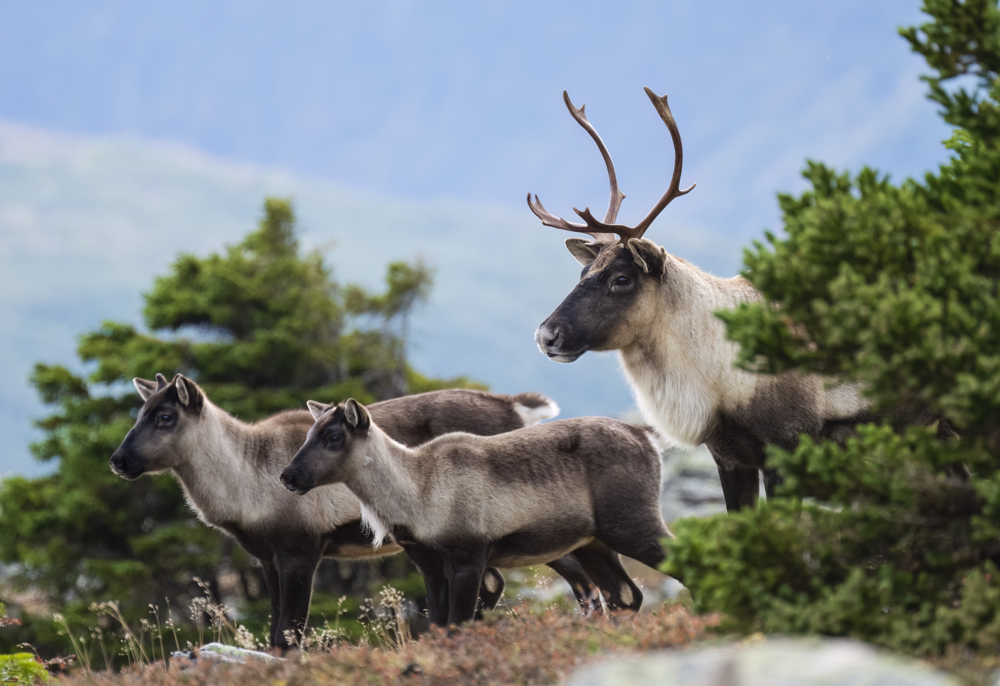

#### **Objet** {#intro-purpose}

L’objectif de cette application est de permettre aux utilisateurs d’explorer les projections de la dynamique des populations du caribou boréal. 

Ces projections tiennent compte de l’incertitude concernant l’état actuel des populations de caribou boréal et leur évolution future.

Les paramètres du modèle démographique des caribous, ainsi que l’incertitude associée à ces paramètres, sont estimés à partir des données disponibles sur la survie des caribous munis de colliers et sur le nombre de faons observés par femelle lors des relevés aériens, en utilisant une version modifiée du package R <a href="https://poissonconsulting.github.io/bboutools/" target="_blank">bboutools</a>. 

Ces estimations de paramètres servent à **projeter les changements probables de la population au fil du temps, en supposant qu’il n’y ait pas de modifications futures des taux moyens de survie et de recrutement**.

Nous projetons une valeur moyenne de la population au fil du temps ainsi qu’un ensemble de trajectoires plausibles, obtenues en sélectionnant aléatoirement des valeurs de paramètres dans les distributions d’incertitude estimées. 

La variation entre ces trajectoires reflète l’incertitude des projections, qui reposent uniquement sur les données locales disponibles des relevés. Dans cette version de l’application, **cette incertitude peut être réduite en acquérant davantage de données**.

Nous travaillons également sur des méthodes permettant de réduire l’incertitude en utilisant des connaissances sur l’état du paysage et les résultats observés pour les populations de caribous à l’échelle nationale. Ces méthodes seront intégrées dans les futures versions de l’application.

L’application permet aux utilisateurs d’ajouter et d’analyser des données sur les populations qui les intéressent. **Ils peuvent ensuite explorer comment la modification des taux de survie et de recrutement influencerait les résultats attendus pour les caribous**.

#### **Auteurs**
Cette application a été créée par Sarah Endicott et Josie Hughes (Division des sciences de la faune et des paysages, Environnement et Changement climatique Canada) ainsi que Danielle Cantin (Service canadien de la faune, Environnement et Changement climatique Canada).

#### **Remerciements**
Guy Larocque et Rebecca Viejou (Service canadien des forêts, Ressources naturelles Canada) ont contribué à la conceptualisation de l’application et à la compilation des données disponibles.

